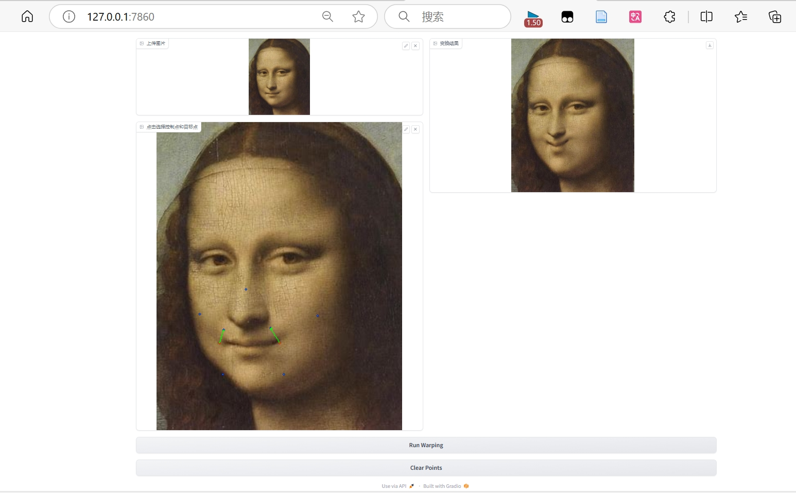

# Assignment 1 - Image Warping

---
## Implementation of Image Geometric Transformation

This repository is Xiao Zhang's implementation of Assignment_01 of DIP. 



## Requirements

To install requirements:

```setup
python -m pip install -r requirements.txt
```


## Running

To run basic transformation, run:

```basic
python run_global_transform.py
```

To run point guided transformation, run:

```point
python run_point_transform.py
```

## Results (need add more result images)
### Basic Transformation

https://github.com/GrowLaugh/zuoye/issues/2#issue-2555854691
  
### Point Guided Deformation:

https://github.com/GrowLaugh/zuoye/issues/1#issue-2555831388) 
https://github.com/GrowLaugh/zuoye/blob/main/01_ImageWarping/images/cxk2.pt.mp4


https://github.com/user-attachments/assets/ac66f094-08dd-4e55-8947-c641c52bc739


## Acknowledgement

>📋 Thanks for the algorithms proposed by [Image Deformation Using Moving Least Squares](https://people.engr.tamu.edu/schaefer/research/mls.pdf).
