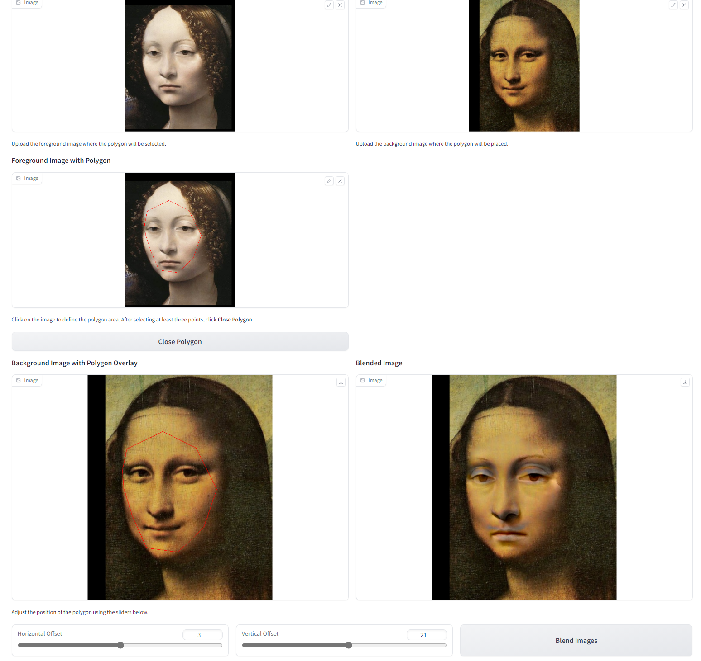
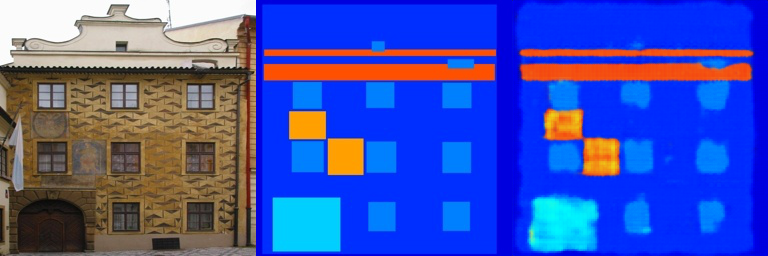
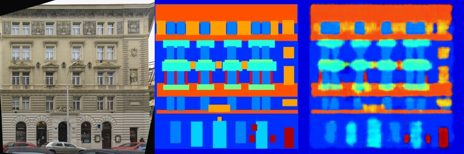
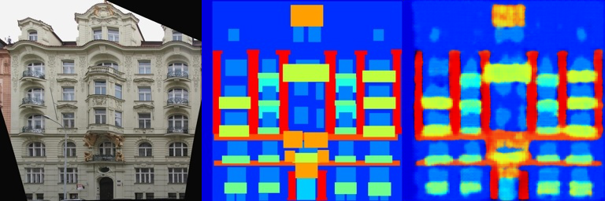
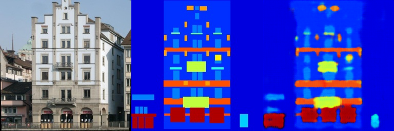
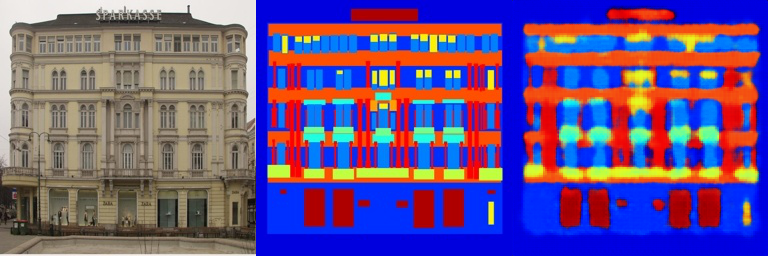
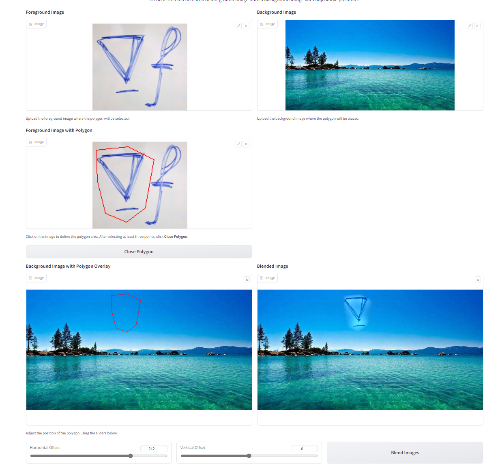
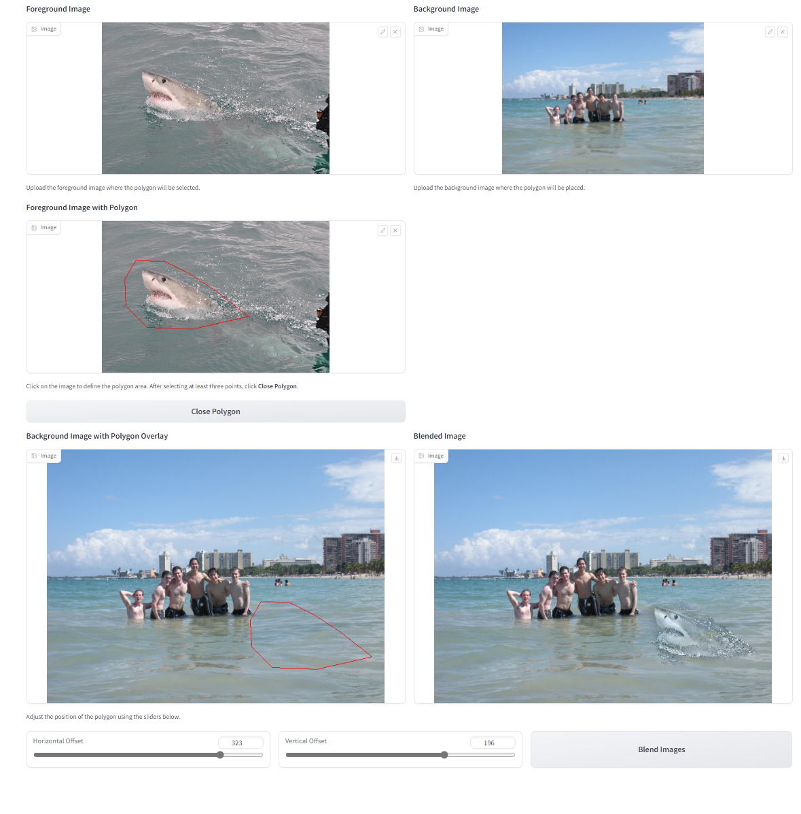
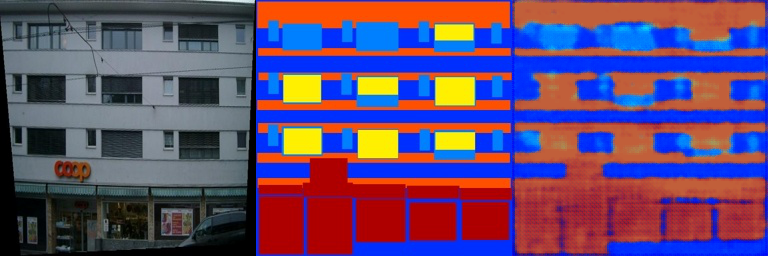

# Assignment 2 - DIP with PyTorch

### In this assignment, you will implement traditional DIP (Poisson Image Editing) and deep learning-based DIP (Pix2Pix) with PyTorch.


### 1. Implement Poisson Image Editing with PyTorch.
Fill the [Polygon to Mask function](run_blending_gradio.py#L95) and the [Laplacian Distance Computation](run_blending_gradio.py#L115) of 'run_blending_gradio.py'.



### 2. Pix2Pix implementation.
See more in [results_image subfolder](results_image/).






---
### Requirements:
- 请自行环境配置，推荐使用[conda环境](https://docs.anaconda.com/miniconda/)
or  to install requirements:
```setup
python -m pip install -r requirements.txt
```
## Running

To run poisson image editing , run:

```basic
python run_blendng_gradio.py
```

To run Pix2Pix, run:

```point
python train.py
```

## Results 
### Poisson Image Editing with PyTorch



---
### Pix2Pix:


https://github.com/user-attachments/assets/ebd8efaf-c2c7-4f78-ba3c-16eed2d6d48e





## Acknowledgement
- [Assignment Slides](https://rec.ustc.edu.cn/share/705bfa50-6e53-11ef-b955-bb76c0fede49)  
- [Paper: Poisson Image Editing](https://www.cs.jhu.edu/~misha/Fall07/Papers/Perez03.pdf)
- [Paper: Image-to-Image Translation with Conditional Adversarial Nets](https://phillipi.github.io/pix2pix/)
- [Paper: Fully Convolutional Networks for Semantic Segmentation](https://arxiv.org/abs/1411.4038)
- [PyTorch Installation & Docs](https://pytorch.org/)
